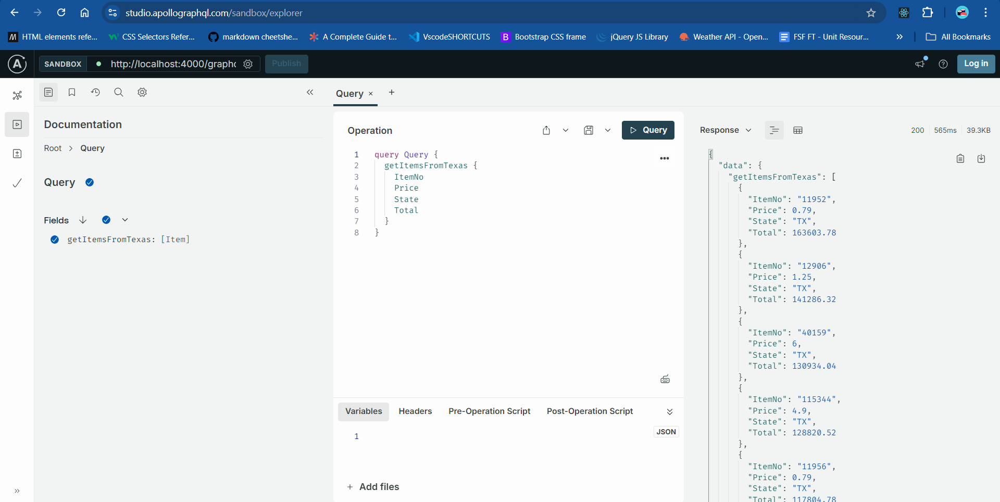
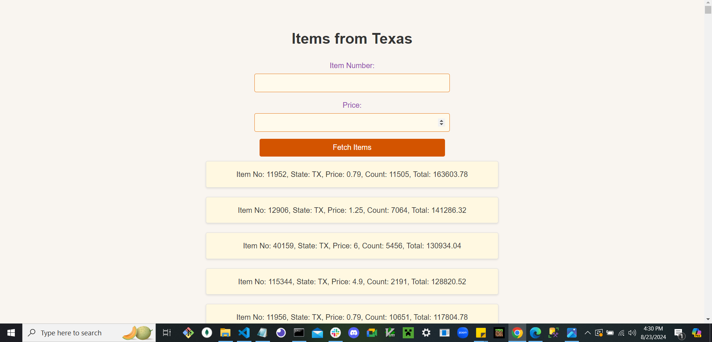

# bizql

Welcome to a little side project where I built an apollo api to handle queries for a database full of items sold in texas.

## Table of Contents
- [technologies](#technologies)
- [Installation](#installation)
- [Usage](#usage)
- [Contributing](#contributing)
- [License](#license)

## Technologies

This project was built using the following technologies:
- Node.js
- Apollo Server
- GraphQL
- SQLServer
- JavaScript
- CSS/HTML
- Express.js

## Installation

To install the project, you will need to clone the repository and run the following commands:

```npm install```
this will install all the dependencies needed to run the project.

```npm run start```
this will start the server on localhost:4000,
if you want to use the graphql studio, you can navigate to localhost:4000/graphql

## Usage

The front end features a very straight forward set of two inputs, one for the item number and one for price. The user can input the item number and price and the api will return the item name and price.

The apollo api provides you with apollo studio in which you can play around with the different queries that are set up in the schema, if one were to update this for future use; there are files in the "update" directory that contain some possible mutations that could be used to update the database. This is strictly for demonstration purposes and should not be used in a production environment.

see below for graphql studio example:



)


## Contributing

Best thing to contribute would be to take a crack at the mutations, though remember to use the correct data types and naming conventions to properly update the database. 

## License

None
```
